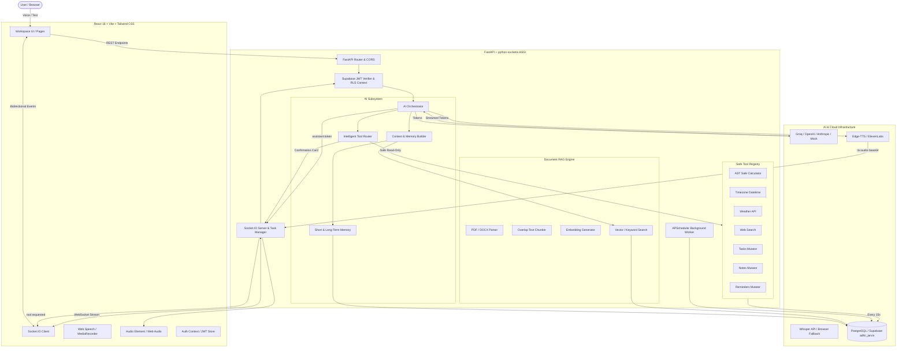

# Adhii Jarvis — System Architecture Specification

## 1. System Overview & Core Philosophy
**Adhii Jarvis** ("Think. Speak. Act.") is an intelligent, full-stack personal AI workspace engineered for high-performance productivity, natural voice conversation, safe automated action execution, and grounded document intelligence.

The architecture emphasizes three core engineering principles:
1. **Decoupled Provider Abstraction**: LLM, STT, and TTS engines are interfaced through abstract base adapters, allowing seamless switching between Groq, OpenAI, Anthropic, ElevenLabs, and Edge-TTS without touching business logic.
2. **Transparent, Confirmed Tool Execution**: Safe read-only tools execute autonomously; state-mutating actions (tasks, notes, reminders) require user confirmation cards before database commits.
3. **Strict Data Isolation**: PostgreSQL Row Level Security (RLS) ensures that User A can never inspect or alter User B's conversations, memories, documents, notes, or tasks.

---

## 2. High-Level Architecture Diagram

---

## 3. End-to-End Message & Streaming Lifecycle

### 3.1 Text & Streaming Flow
1. **User Input**: The user types a prompt into the `ChatInput` component.
2. **Optimistic UI**: The message is rendered immediately in the chat log.
3. **Socket Event**: Client emits `chat:send` with `conversation_id` and `message`.
4. **JWT Verification**: The socket manager validates the caller's JWT token and establishes `user_id`.
5. **Memory & Context Retrieval**:
   - `ShortTermMemory` extracts the last 8 messages plus any historical conversation summary.
   - `LongTermMemory` fetches relevant user preferences and facts.
   - `DocumentRetriever` queries vector/keyword chunks if document references exist.
6. **Tool Routing**:
   - `ToolRouter` inspects the text for calculations, datetime queries, weather, search, notes, tasks, or reminders.
   - If a **read-only tool** is detected (e.g. calculator for `18% of 42,000`), the tool runs immediately and appends results to the model context.
   - If a **state-mutating tool** is detected (e.g. `create_task`), the orchestrator yields `tool:requested` with an activity ID and pauses execution until authorized.
7. **Token Streaming**: The configured provider (`GroqProvider`, `OpenAIProvider`, `AnthropicProvider`, or `MockLLMProvider`) streams tokens incrementally.
8. **Real-time Emission**: Backend emits `assistant:token` events via Socket.IO, updating the UI word-by-word with `requestAnimationFrame` smoothness.
9. **Persistence**: The full assistant response is saved to the PostgreSQL `messages` table.

### 3.2 Voice Interaction Flow
1. **Microphone Activation**: Push-to-talk button triggers `navigator.mediaDevices.getUserMedia`.
2. **Audio Chunking**: MediaRecorder encodes audio into 250ms chunks and emits `voice:audio` events.
3. **Speech-to-Text**: On `voice:end`, `WhisperSTTProvider` converts the audio to text (or accepts the Web Speech API transcript fallback).
4. **Orchestration**: The transcript flows directly through the AI Orchestrator pipeline.
5. **Audio Synthesis**: Assistant text is converted to audio bytes via `EdgeTTSProvider` (or ElevenLabs) and emitted as `tts:audio` base64 packets.
6. **Browser Playback**: HTML5 Audio element plays the spoken response while waveform visualizers animate in real time.
